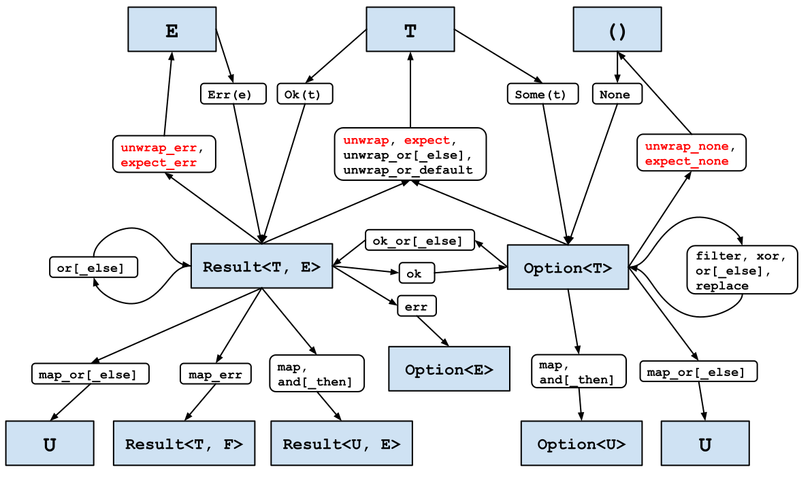

# 第 3 条：避免匹配 Option 和 Result

[第1条] 阐述了枚举（`enum`）的优点，并展示了 `match` 表达式如何强制程序员考虑所有可能性；这个方法探讨了在某些情况下，你应尽量避免使用 `match` 表达式 —— 至少是显式地。

[第1条] 还介绍了 Rust 标准库提供的两个无处不在的枚举：
- `Option<T>`，表示一个值（类型为 `T`）可能存在也可能不存在。
- `Result<T, E>`，用于当尝试返回一个值（类型为 `T`）的操作可能失败，并可能返回一个错误（类型为 `E`）。

对于这些特定的枚举，显式使用 `match` 通常会导致代码比实际需要的不够紧凑，而且不符合 Rust 的习惯用法。

第一种不需要使用 `match` 的情况是，当只关心值本身，而值的缺失（以及任何相关的错误）可以被忽略时。

```rust
struct S {
    field: Option<i32>,
}

let s = S { field: Some(42) };
match &s.field {
    Some(i) => println!("field is {}", i),
    None => {}
}
```

对于这种情况，使用 `if let` 表达式可以缩短一行代码，而且更重要的是，它的表达更清晰：

```rust
if let Some(i) = &s.field {
    println!("field is {}", i);
}
```

然而，大多数时候，值的缺失以及相关的错误是程序员必须处理的问题。设计软件以应对失败路径是困难的，大多数情况下这是无法通过语法支持减少的固有复杂性 —— 特别是，决定如果操作失败应该发生什么。

在某些情况下，正确的决定是执行一种鸵鸟策略，明确不处理失败。如果使用显式的 `match` 来这样做，会显得不必要的冗长：

```rust
let result = std::fs::File::open("/etc/passwd");
let f = match result {
    Ok(f) => f,
    Err(_e) => panic!("Failed to open /etc/passwd!"),
};
```

尽管如此，要明确一点：这些辅助函数仍然会引发 `panic!`，所以选择使用它们与选择直接 `panic!`（[第18条]）是一样的。

然而，在许多情况下，正确的错误处理决策是将决策推迟给其他人。这在编写库时尤其正确，因为库的代码可能会在库作者无法预见的各种不同环境中使用。为了使其他人的工作更容易，即使这可能涉及不同错误类型之间的转换（[第4条]），也更倾向于使用 `Result` 而不是 `Option`。

`Result` 也有一个 `[#must_use]` 属性，用来引导库用户朝着正确的方向前进 —— 如果使用返回的 `Result` 的代码忽略了它，编译器将生成一个警告：

```rust
warning: unused `Result` that must be used
  --> transform/src/main.rs:32:5
   |
32 |     f.set_len(0); // Truncate the file
   |     ^^^^^^^^^^^^^
   |
   = note: `#[warn(unused_must_use)]` on by default
   = note: this `Result` may be an `Err` variant, which should be handled

```

显式使用 `match` 可以让错误传播，但代价是增加了一些可见的样板代码（让人联想到 `Go 语言`）：

```rust
pub fn find_user(username: &str) -> Result<UserId, std::io::Error> {
    let f = match std::fs::File::open("/etc/passwd") {
        Ok(f) => f,
        Err(e) => return Err(e),
    };
    // ...
}
```

减少样板代码的关键是 Rust 的问号运算符 `?`。这个语法糖可以处理匹配 `Err` 分支和返回 `Err(...)` 表达式，只用一个字符就完成了：

```rust
pub fn find_user(username: &str) -> Result<UserId, std::io::Error> {
    let f = std::fs::File::open("/etc/passwd")?;
    // ...
}
```

Rust 新手有时会对此感到困惑：问号运算符在一开始很难被注意到，导致人们怀疑这段代码怎么可能正常工作。然而，即使只有一个字符，类型系统仍然在起作用，确保覆盖了相关类型（[第1条]）表达的所有可能性——让程序员可以专注于主线代码路径，不受干扰。

更重要的是，这些明显的方法调用通常没有额外的成本：它们都是标记为 `#[inline]` 的泛型函数，所以生成的代码通常会编译成与手动版本相同的机器代码。

这两个因素结合起来意味着你应该优先使用 `Option` 和 `Result` 转换，而不是显式的 `match` 表达式。

在之前的例子中，错误类型是一致的：内部和外部方法都使用 `std::io::Error` 表达错误。然而，情况往往并非如此；一个函数可能从各种不同的子库中累积错误，每个子库都使用不同的错误类型。

关于错误映射的讨论一般见[第4条]；现在，只需知道一个手动映射：

```rust
pub fn find_user(username: &str) -> Result<UserId, String> {
    let f = match std::fs::File::open("/etc/passwd") {
        Ok(f) => f,
        Err(e) => {
            return Err(format!("Failed to open password file: {:?}", e))
        }
    };
    // ...
}
```

可以使用更简洁、更符合 Rust 语法的 `.map_err()` 转换来表达：

```rust
pub fn find_user(username: &str) -> Result<UserId, String> {
    let f = std::fs::File::open("/etc/passwd")
        .map_err(|e| format!("Failed to open password file: {:?}", e))?;
    // ...
}
```

更好的是，甚至这可能也不必要 —— 如果外部错误类型可以通过实现标准特征 `From`（[第5条]）从内部错误类型创建，那么编译器将自动执行转换，无需调用 `.map_err()`。

这类转换具有更广泛的通用性。问号运算符是一个强大的工具；使用 `Option` 和 `Result` 类型上的转换方法将它们调整到可以顺利处理的形态。

标准库提供了各种各样的转换方法来实现这一点，如下面的地图所示。根据[第18条]，可能引发 `panic!` 的方法用红色突出显示。



（此图的[在线版本]可点击：每个框都会链接到相关文档。）

图中未涵盖的一种常见情况是处理引用。例如，考虑一个可能包含一些数据的结构。

```rust
struct InputData {
    payload: Option<Vec<u8>>,
}
```

这个结构上的一个方法尝试将有效载荷传递给一个加密函数，该函数的签名是 `(&[u8]) -> Vec<u8>`，如果简单地尝试获取一个引用，则会失败：

<div class="ferris"></div>

```rust
impl InputData {
    pub fn encrypted(&self) -> Vec<u8> {
        encrypt(&self.payload.unwrap_or(vec![]))
    }
}
```

```rust
error[E0507]: cannot move out of `self.payload` which is behind a shared reference
  --> transform/src/main.rs:62:22
   |
62 |             encrypt(&self.payload.unwrap_or(vec![]))
   |                      ^^^^^^^^^^^^ move occurs because `self.payload` has type `Option<Vec<u8>>`, which does not implement the `Copy` trait
   |
help: consider borrowing the `Option`'s content
   |
62 |             encrypt(&self.payload.as_ref().unwrap_or(vec![]))
   |                                  +++++++++
```

错误消息准确地描述了使代码工作所需的内容，即 `Option` 上的 `as_ref()` 方法[^1]。这个方法将一个对 `Option` 的引用转换为对引用的 `Option`：

```rust
pub fn encrypted(&self) -> Vec<u8> {
    encrypt(self.payload.as_ref().unwrap_or(&vec![]))
}
```

总结一下：

- 习惯使用 `Option` 和 `Result` 的转换，并且优先使用 `Result` 而不是 `Option`。
- 在转换涉及引用时，根据需要使用 `.as_ref()`。
- 在可能的情况下，优先使用它们而不是显式的 `match` 操作。
- 特别是，使用它们将结果类型转换成可以使用 `?` 运算符的形式。

---

#### 注释

[^1]: 注意，这个方法与 `AsRef` 特征是分开的，尽管方法名称相同。

原文[点这里](https://www.lurklurk.org/effective-rust/transform.html)查看

<!-- 参考链接 -->

[第1条]: use-types.md
[第4条]: https://www.lurklurk.org/effective-rust/errors.html
[第5条]: https://www.lurklurk.org/effective-rust/std-traits.html
[第18条]: https://www.lurklurk.org/effective-rust/panic.html

[在线版本]: https://tinyurl.com/rust-transform
